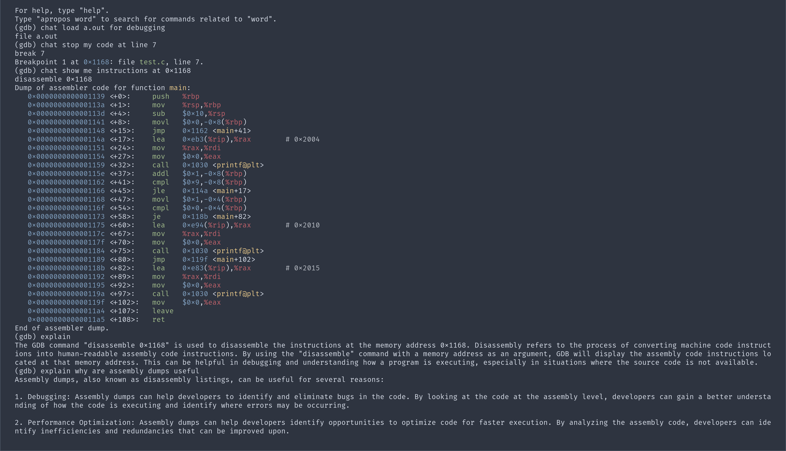

# ChatGDB
Harness the power of ChatGPT inside the GDB debugger!


### Installation instructions
For now, the easiest way to install this is to simply clone the repository. You will need an API key, which you can get from [here](https://chatgpt.en.obiscr.com/blog/posts/2023/How-to-get-api-key/).
Create a .env file in the root of the project following the example provided with your key.

### How to use
While inside gdb, source the core.py file with ```source /path/to/core.py```. Then you can use the command chat_gdb appended by your query, for example ```chat list all breakpoints that I created```. There is also a command called ```explain``` that you can use with no arguments to explain the previously run command, and optionally, with a query to just ask GPT a question.

You can also edit your ```$HOME/.gdbinit``` and source the file automatically on startup.
